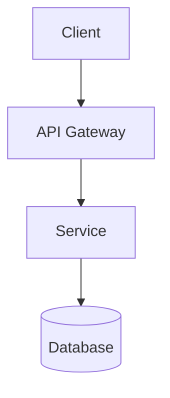

Provide expert guidance on system architecture decisions, design approaches, and technical strategy. Optionally generate Architecture Decision Records (ADRs) to document significant choices.

## Input Classification

First, classify the request to determine the appropriate approach:

| Type | Indicators | Approach |
|------|-----------|----------|
| **Greenfield** | "new system", "from scratch", "build new" | Full architecture process |
| **Evolution** | "add feature", "extend", "enhance" | Pattern analysis + incremental design |
| **Migration** | "move to", "replace", "upgrade" | Risk assessment + phased plan |
| **Optimization** | "scale", "performance", "bottleneck" | Bottleneck analysis + targeted changes |
| **Integration** | "connect", "integrate", "API" | Interface design + compatibility |
| **ADR** | "--adr", "document decision", "record choice" | Architecture Decision Record |

## Process

### For Architecture Design

1. **Analyze Existing Patterns**
   - Find similar features or modules in codebase
   - Document established conventions
   - Identify technology stack and abstraction layers
   - Note relevant CLAUDE.md guidelines

2. **Clarify Requirements**
   - Functional requirements (what the system does)
   - Non-functional requirements (scalability, latency, availability)
   - Constraints (budget, timeline, team skills, existing systems)

3. **Estimate Scale**
   - Users: DAU, MAU, peak concurrent
   - Data: Storage size, growth rate, retention
   - Traffic: QPS, read/write ratio, burst patterns

4. **Define Components**
   - Core services and their responsibilities
   - Data stores and caching layers
   - External integrations and APIs
   - Interface definitions and contracts

5. **Design Interactions**
   - Synchronous vs asynchronous communication
   - API contracts and protocols
   - Error handling and retry strategies

6. **Address Cross-Cutting Concerns**
   - Authentication and authorization
   - Logging, monitoring, alerting
   - Security and compliance

7. **Create Implementation Blueprint**
   - Map components to specific files
   - Define build sequence with dependencies
   - Specify verification approach

### For ADR Generation

1. Ask for decision context if not provided
2. Identify decision drivers (what forces are at play?)
3. List 2-3 considered options with Pros/Cons
4. Recommend a decision with clear rationale
5. Document consequences (positive, negative, risks)
6. Write ADR to `docs/architecture/decisions/adr-NNN-title.md`

## Architecture Patterns

| Pattern | Best For | Key Trade-off |
|---------|----------|---------------|
| Monolithic | Small teams, simple domains, rapid prototyping | Simple deployment vs limited scalability |
| Microservices | Large teams, complex domains, independent scaling | Flexibility vs operational complexity |
| Event-Driven | Async workflows, audit trails, temporal decoupling | Loose coupling vs eventual consistency |
| Serverless | Variable workloads, cost optimization | Reduced ops burden vs vendor lock-in |

## Response Format

### For Architecture Design

```markdown
## Architecture Recommendation

### Context
[Understanding of requirements and constraints]

### Existing Patterns Analysis
[Summary of codebase conventions and patterns to follow]

### Proposed Architecture
[High-level description with mermaid diagram]



### Key Components
| Component | Responsibility | Technology Options |
|-----------|---------------|-------------------|

### Trade-offs
| Decision | Pros | Cons |
|----------|------|------|

### Risks & Mitigations
- Risk: [Description] → Mitigation: [Approach]

### Implementation Blueprint

#### Files to Create
| File | Purpose | Dependencies |
|------|---------|--------------|
| `src/domain/[entity].ts` | [What it defines] | None |
| `src/application/[service].ts` | [What it does] | `[entity].ts` |

#### Files to Modify
| File | Change | Reason |
|------|--------|--------|

#### Component Interfaces
[TypeScript interface definitions]

### Build Sequence

- [ ] **Phase 1: Domain Layer**
  - [ ] Create entity types
  - [ ] Define value objects
  - [ ] Verify: Unit tests pass

- [ ] **Phase 2: Application Layer**
  - [ ] Implement service interfaces
  - [ ] Create DTOs
  - [ ] Verify: Integration tests pass

- [ ] **Phase 3: Infrastructure Layer**
  - [ ] Implement repositories
  - [ ] Configure external services
  - [ ] Verify: E2E tests pass

### Critical Details Checklist

- [ ] Error handling strategy defined
- [ ] State management approach chosen
- [ ] Testing strategy covers pyramid
- [ ] Performance considerations addressed
- [ ] Security requirements met

### Next Steps
1. [Immediate action]
2. [Follow-up action]
```

### For ADR (--adr flag)

```markdown
# ADR-[NNN]: [Decision Title]

**Status:** Proposed | Accepted | Deprecated | Superseded
**Date:** YYYY-MM-DD
**Author:** [Name]

## Context

[What is the issue that we're seeing that is motivating this decision?]

## Decision Drivers

- [Driver 1: e.g., scalability requirement]
- [Driver 2: e.g., team expertise]
- [Driver 3: e.g., time constraint]

## Considered Options

### Option 1: [Name]

[Description of the option]

**Pros:**
- Pro 1
- Pro 2

**Cons:**
- Con 1
- Con 2

### Option 2: [Name]

[Description]

**Pros:**
- Pro 1

**Cons:**
- Con 1

### Option 3: [Name]

[Description]

**Pros:**
- Pro 1

**Cons:**
- Con 1

## Decision

We will use **[Option X]** because [rationale].

## Consequences

### Positive
- [Benefit 1]
- [Benefit 2]

### Negative
- [Drawback 1]
- [Drawback 2]

### Risks
- [Risk 1]: [Mitigation]

## Related Decisions

- [Link to related ADR if applicable]

## References

- [Link to relevant documentation]
```

## ADR Guidelines

### When to Write an ADR

**Write one when:**
- Choosing between multiple valid technical approaches
- Adopting or changing frameworks/libraries
- Defining API contracts or data formats
- Establishing coding standards or patterns
- Making infrastructure decisions
- Changing system architecture

**Skip when:**
- Trivial decisions easily reversed
- Standard practices with no alternatives
- Bug fixes or routine maintenance

### ADR Statuses

| Status | Meaning |
|--------|---------|
| **Proposed** | Under discussion, not yet accepted |
| **Accepted** | Decision made and in effect |
| **Deprecated** | No longer applies, kept for history |
| **Superseded** | Replaced by a newer ADR |

### File Organization

```text
docs/architecture/decisions/
├── README.md
├── adr-001-use-typescript.md
├── adr-002-api-versioning-strategy.md
└── adr-003-database-selection.md
```

## Error Handling

When analysis is incomplete or uncertain:

1. **Partial Results**: Present what was designed with clear `[Incomplete]` markers
2. **Confidence Flags**: Mark recommendations as `[High Confidence]` or `[Needs Verification]`
3. **Assumption Documentation**: Explicitly list assumptions that could invalidate the design
4. **Fallback Strategy**: If codebase exploration fails, proceed with stated assumptions

For ADRs:
1. **Partial Results**: Create ADR with `[TBD]` markers for sections needing input
2. **Draft Status**: Use `Proposed` status until all sections are complete
3. **Missing Context**: Explicitly list questions that need answers

Never silently skip sections—surface gaps and limitations explicitly.

## Related Skills

| After This Skill | Consider Using | When |
|-----------------|----------------|------|
| `/architecture` | `/patterns` | Need specific pattern implementation |
| `/architecture` | `/diagram` | Visual representation would clarify |
| `/architecture` | `/review` | Existing code needs evaluation |
| `/architecture` | `/explore` | Need to understand existing system first |
| `/architecture` | `/docs` | Need detailed documentation beyond ADR |
