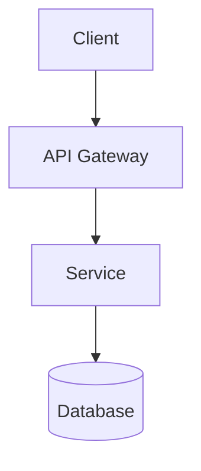

# Architecture Response Templates

Templates for architecture design recommendations and Architecture Decision Records (ADRs).

## Architecture Design Template

```markdown
## Architecture Recommendation

### Context
[Understanding of requirements and constraints]

### Existing Patterns Analysis
[Summary of codebase conventions and patterns to follow]

### Proposed Architecture
[High-level description with mermaid diagram]



### Key Components
| Component | Responsibility | Technology Options |
|-----------|---------------|-------------------|

### Trade-offs
| Decision | Pros | Cons |
|----------|------|------|

### Risks & Mitigations
- Risk: [Description] → Mitigation: [Approach]

### Implementation Blueprint

#### Files to Create
| File | Purpose | Dependencies |
|------|---------|--------------|
| `src/domain/[entity].ts` | [What it defines] | None |
| `src/application/[service].ts` | [What it does] | `[entity].ts` |

#### Files to Modify
| File | Change | Reason |
|------|--------|--------|

#### Component Interfaces
[TypeScript interface definitions]

### Next Steps
1. [Immediate action]
2. [Follow-up action]
```

## ADR Template

```markdown
# ADR-[NNN]: [Decision Title]

**Status:** Proposed | Accepted | Deprecated | Superseded
**Date:** YYYY-MM-DD
**Author:** [Name]

## Context

[What is the issue that we're seeing that is motivating this decision?]

## Decision Drivers

- [Driver 1: e.g., scalability requirement]
- [Driver 2: e.g., team expertise]
- [Driver 3: e.g., time constraint]

## Considered Options

### Option 1: [Name]

[Description of the option]

**Pros:**
- Pro 1
- Pro 2

**Cons:**
- Con 1
- Con 2

### Option 2: [Name]

[Description]

**Pros:**
- Pro 1

**Cons:**
- Con 1

### Option 3: [Name]

[Description]

**Pros:**
- Pro 1

**Cons:**
- Con 1

## Decision

We will use **[Option X]** because [rationale].

## Consequences

### Positive
- [Benefit 1]
- [Benefit 2]

### Negative
- [Drawback 1]
- [Drawback 2]

### Risks
- [Risk 1]: [Mitigation]

## Related Decisions

- [Link to related ADR if applicable]

## References

- [Link to relevant documentation]
```
