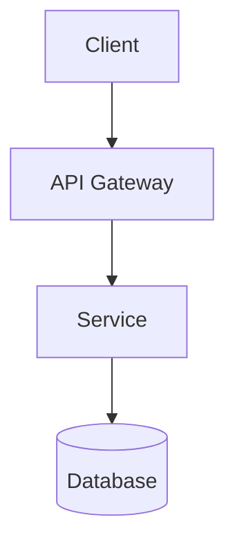

# Architecture Response Templates

Templates for architecture design recommendations and Architecture Decision Records (ADRs).

## Architecture Design Template

```markdown
## Architecture Recommendation

### Context
[Understanding of requirements and constraints]

### Existing Patterns Analysis
[Summary of codebase conventions and patterns to follow]

### Non-Functional Requirements
| Requirement | Target | Priority |
|-------------|--------|----------|
| **Scalability** | [e.g., 10K concurrent users] | High |
| **Latency** | [e.g., p95 < 200ms] | High |
| **Availability** | [e.g., 99.9% uptime] | Medium |
| **Durability** | [e.g., no data loss] | High |

### Proposed Architecture
[High-level description with mermaid diagram]


```mermaid
graph TD
    A[Client] --> B[API Gateway]
    B --> C[Service]
    C --> D[(Database)]
```

### Key Components
| Component | Responsibility | Technology Options |
|-----------|---------------|-------------------|

### Trade-offs
| Decision | Pros | Cons |
|----------|------|------|

### Risks & Mitigations
- Risk: [Description] → Mitigation: [Approach]

### Implementation Blueprint

#### Files to Create
| File | Purpose | Dependencies |
|------|---------|--------------|
| `src/domain/[entity].ts` | [What it defines] | None |
| `src/application/[service].ts` | [What it does] | `[entity].ts` |

#### Files to Modify
| File | Change | Reason |
|------|--------|--------|

#### Component Interfaces
[TypeScript interface definitions]

### Next Steps
1. [Immediate action]
2. [Follow-up action]
```

## Migration Plan Template

For phased migrations, replacements, or system transitions:

```markdown
## Migration Plan: [Source] → [Target]

### Context
[Current state and motivation for migration]

### Migration Strategy
**Approach:** [Big bang | Strangler fig | Parallel run | Phased rollout]

**Rationale:** [Why this strategy fits the constraints]

### Migration Phases

#### Phase 1: [Name]
- **Goal:** [What this phase achieves]
- **Duration:** [Estimated time]
- **Steps:**
  1. [Action item]
  2. [Action item]
- **Success Criteria:** [How to validate this phase]
- **Rollback Plan:** [How to revert if issues arise]

#### Phase 2: [Name]
- **Goal:** [What this phase achieves]
- **Duration:** [Estimated time]
- **Steps:**
  1. [Action item]
- **Success Criteria:** [How to validate]
- **Rollback Plan:** [How to revert]

### Data Migration Strategy
- **Approach:** [Dual-write | Batch migration | Event replay]
- **Validation:** [How to verify data integrity]
- **Cutover Plan:** [Final switchover steps]

### Rollback Strategy
- **Trigger Conditions:** [What situations require rollback]
- **Rollback Steps:**
  1. [Action]
  2. [Action]
- **Recovery Time:** [How long rollback takes]

### Monitoring & Validation
- **Key Metrics:** [What to monitor during migration]
- **Alerts:** [What conditions should trigger alerts]
- **Verification:** [How to confirm migration success]

### Risks & Mitigations
| Risk | Impact | Probability | Mitigation |
|------|--------|-------------|------------|
| [Risk description] | High/Medium/Low | High/Medium/Low | [How to address] |
```

## ADR Template

```markdown
# ADR-[NNN]: [Decision Title]

**Status:** Proposed | Accepted | Deprecated | Superseded
**Date:** YYYY-MM-DD
**Author:** [Name]

## Context

[What is the issue that we're seeing that is motivating this decision?]

## Decision Drivers

- [Driver 1: e.g., scalability requirement]
- [Driver 2: e.g., team expertise]
- [Driver 3: e.g., time constraint]

## Considered Options

### Option 1: [Name]

[Description of the option]

**Pros:**
- Pro 1
- Pro 2

**Cons:**
- Con 1
- Con 2

### Option 2: [Name]

[Description]

**Pros:**
- Pro 1

**Cons:**
- Con 1

### Option 3: [Name]

[Description]

**Pros:**
- Pro 1

**Cons:**
- Con 1

## Decision

We will use **[Option X]** because [rationale].

## Consequences

### Positive
- [Benefit 1]
- [Benefit 2]

### Negative
- [Drawback 1]
- [Drawback 2]

### Risks
- [Risk 1]: [Mitigation]

## Related Decisions

- [Link to related ADR if applicable]

## References

- [Link to relevant documentation]
```
