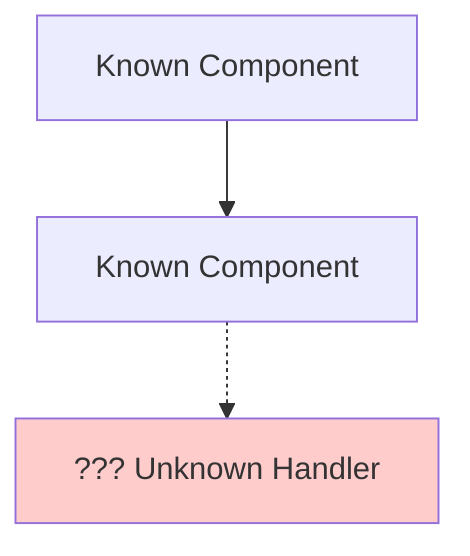

Generate architecture diagrams using Mermaid syntax based on the user's description or codebase.

## When to Use

### This Skill Is For

- Visualizing system architecture and component interactions
- Creating flowcharts for process workflows
- Generating data models (ERD) and class diagrams

### Use a Different Approach When

- Understanding system first → use `/explore`
- Designing architecture → use `/architecture`
- Need implementation details beyond visualization → use `/patterns`

## Diagram Selection

| Need | Diagram Type |
|------|--------------|
| High-level system overview | C4 Context |
| Technical architecture | C4 Container |
| Component interactions | C4 Component |
| API call flows | Sequence |
| Process workflows | Flowchart |
| Data models | ERD |
| Object design | Class |
| Lifecycle states | State |

## Guidelines

1. **One diagram, one purpose** — don't overload a single diagram
2. **Label relationships** — show what flows between components
3. **Include a legend** when using custom notation
4. **Use consistent notation** throughout
5. **Start with the highest useful abstraction level** — zoom in only if asked

## Process

1. Ask what the user wants to visualize if `$ARGUMENTS` is unclear
2. Choose the appropriate diagram type from the selection table
3. Generate the `mermaid` code block
4. Explain the key relationships and components shown
5. Offer to zoom into specific areas or generate complementary diagrams

## Mermaid Reference

**C4 Context**: `C4Context` — system with users and external dependencies
**C4 Container**: `C4Container` — high-level technical components inside the system
**Sequence**: `sequenceDiagram` — interactions over time between participants
**Flowchart**: `flowchart TD/LR` — process flows and decision points
**ERD**: `erDiagram` — data model relationships
**Class**: `classDiagram` — object-oriented structure
**State**: `stateDiagram-v2` — state transitions and lifecycle

## Error Handling

| Scenario | Response |
|----------|----------|
| Incomplete information | Generate what's known with `[Incomplete]` markers |
| Uncertain components | Add `[Needs Verification]` notes to diagram sections |
| Scope limited | Explicitly state what was NOT included and why |
| Unknown components | Use dashed lines or `???` labels for placeholders |

Example for incomplete information:

Never silently omit components—surface gaps visually.

## Related Skills

| Skill | When to Use Instead |
|-------|---------------------|
| `/explore` | Need to understand components before visualizing |
| `/architecture` | Diagram reveals architectural improvements |
| `/architecture --adr` | Diagram documents an important decision |
| `/patterns` | Diagram shows pattern implementation |
