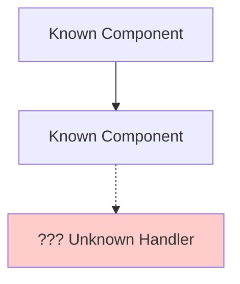

Generate architecture diagrams using Mermaid syntax based on the user's description or codebase.

## Diagram Philosophy

- **One diagram, one purpose** — don't overload a single diagram; split multi-concern visualizations
- **Label relationships** — show what flows between components, not just that they connect
- **Consistent notation** — use the same shapes, colors, and line styles for the same concepts throughout
- **Start at highest abstraction** — begin with the most useful abstraction level; zoom in only when asked
- **Include legends** — when using custom notation or color coding, always provide a legend

## When to Use

### This Skill Is For

- Visualizing system architecture and component interactions
- Creating flowcharts for process workflows
- Generating data models (ERD) and class diagrams

### Use a Different Approach When

- Understanding system first → use `/explore`
- Designing architecture → use `/architecture`
- Need implementation details beyond visualization → use `/patterns`

## Input Classification

Determine diagram workflow from `$ARGUMENTS`:

| Input | Intent | Approach |
|-------|--------|----------|
| Topic/concept (e.g., `auth flow`) | Describe system | Steps 1-4; emphasis on requirements gathering (step 1) |
| File path (e.g., `src/auth/login.ts`) | Diagram from code | Steps 1-4; emphasis on code reading (step 2) |
| Directory (e.g., `src/auth/`) | Diagram module | Steps 1-4; emphasis on code reading (step 2) |
| Component name (e.g., `LoginService`) | Diagram interactions | Steps 1-4; emphasis on search + generation (steps 1-2) |
| (none) | Ask user | Pre-flight stop |

## Diagram Selection

| Need | Diagram Type |
|------|--------------|
| High-level system overview | C4 Context |
| Technical architecture | C4 Container |
| Component interactions | C4 Component |
| API call flows | Sequence |
| Process workflows | Flowchart |
| Data models | ERD |
| Object design | Class |
| Lifecycle states | State |

## Process

### 1. Pre-flight

- Parse `$ARGUMENTS` and map to the appropriate intent (Topic/Concept, File Path, Directory, Component Name, or Ask User) using the Input Classification table
- If analyzing existing code, verify target files are accessible via Glob/Read
- If from a description, check if enough detail is provided to proceed
- Classify the request using the Diagram Selection table above

**Stop conditions:**
- No arguments provided → ask user what to visualize
- Target file or directory not found → report and stop
- Description too vague to select a diagram type → ask user to clarify
- Scope is ambiguous (e.g., "diagram everything") → ask user to narrow focus

### 2. Generate

- Read source code if diagramming an existing system
- Select diagram type from the Diagram Selection table
- Build the Mermaid diagram following Diagram Philosophy principles
- Use the Mermaid Reference section for correct syntax

### 3. Present

- Output the `mermaid` code block
- Explain key relationships and components shown
- Include a legend when using custom notation

### 4. Verify and Extend

- Confirm the diagram covers the requested scope
- Note any components omitted or marked incomplete
- Offer to zoom into specific areas or generate complementary diagrams
- Suggest related skills if deeper analysis is needed

## Mermaid Reference

**C4 Context**: `C4Context` — system with users and external dependencies
**C4 Container**: `C4Container` — high-level technical components inside the system
**C4 Component**: `C4Component` — internal components within a container
**Sequence**: `sequenceDiagram` — interactions over time between participants
**Flowchart**: `flowchart TD/LR` — process flows and decision points
**ERD**: `erDiagram` — data model relationships
**Class**: `classDiagram` — object-oriented structure
**State**: `stateDiagram-v2` — state transitions and lifecycle

## Output Principles

- **Mermaid code block first** — present the diagram before explanations; let the visual speak first
- **Explain key relationships** — after the diagram, call out important connections and components the user should focus on
- **Surface gaps visually** — use dashed lines, `???` labels, and colored styling for incomplete or unverified sections (not prose disclaimers)
- **Offer extension paths** — suggest zoom-in options or complementary diagrams for areas that deserve more detail

## Argument Handling

| Argument | Behavior |
|----------|----------|
| (none) | Ask user what to visualize |
| Topic or concept (e.g., `auth flow`) | Generate diagram based on the description |
| File path (e.g., `src/auth/login.ts`) | Read the file and diagram its structure |
| Directory (e.g., `src/auth/`) | Read files in the directory and diagram the module |
| Component name (e.g., `LoginService`) | Search for the component, diagram its interactions |

## Error Handling

| Scenario | Response |
|----------|----------|
| Incomplete information | Generate what's known with `[Incomplete]` markers |
| Uncertain components | Add `[Needs Verification]` notes to diagram sections |
| Scope limited | Explicitly state what was NOT included and why |
| Unknown components | Use dashed lines or `???` labels for placeholders |
| Target not found | Report the missing file or component and ask user to verify the path |
| Scope too broad | Ask user to narrow scope to a specific module or flow |
| Diagram too complex | Split into multiple focused diagrams, one per concern |

Example for incomplete information:

```mermaid
flowchart TD
    A[Known Component] --> B[Known Component]
    B -.-> C["??? Unknown Handler"]
    style C fill:#ffcccc
```

Never silently omit components—surface gaps visually.

## Related Skills

| Skill | When to Use Instead |
|-------|---------------------|
| `/explore` | Need to understand components before visualizing |
| `/architecture` | Diagram reveals architectural improvements |
| `/architecture --adr` | Diagram documents an important decision |
| `/patterns` | Diagram shows pattern implementation |
