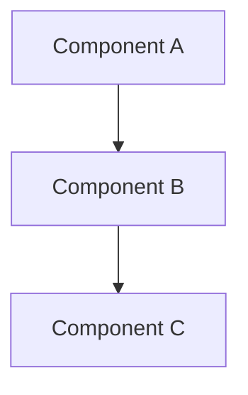

Create and improve technical documentation including READMEs, API docs, RFCs, design documents, and technical specifications.

## When to Use

### This Skill Is For

- Writing README files and project documentation
- Creating API documentation
- Drafting RFCs and design documents
- Technical specification writing
- Documentation review and improvement
- Onboarding documentation

### Use a Different Approach When

- Creating architecture diagrams → use `/diagram`
- Recording architecture decisions → use `/adr`
- Code-level comments → handle inline during development

## Document Types

| Type | Purpose | Audience |
|------|---------|----------|
| **README** | Project overview, quick start | New users, contributors |
| **API Docs** | Endpoint reference | Developers integrating |
| **RFC** | Propose significant changes | Team, stakeholders |
| **Design Doc** | Technical design details | Engineers implementing |
| **Runbook** | Operational procedures | Ops, on-call engineers |
| **ADR** | Decision record | Future maintainers |

## Process

### 1. Identify Document Type

Based on the request, determine:
- What type of document is needed
- Who is the target audience
- What level of detail is appropriate

### 2. Gather Information

- Review existing code and documentation
- Identify key concepts to explain
- Note examples and use cases
- List prerequisites and dependencies

### 3. Structure Content

Follow appropriate template for document type.

### 4. Write with Clarity

- Use clear, concise language
- Include code examples
- Add diagrams where helpful
- Define technical terms

### 5. Review and Refine

- Check for accuracy
- Verify code examples work
- Ensure completeness
- Test instructions

## Response Format

### README Template

```markdown
# Project Name

Brief description of what this project does and why it exists.

## Features

- Feature 1: Brief description
- Feature 2: Brief description
- Feature 3: Brief description

## Quick Start

### Prerequisites

- Node.js >= 18
- npm or yarn

### Installation

```bash
npm install project-name
```

### Basic Usage

```typescript
import { Feature } from 'project-name';

const result = Feature.doSomething();
console.log(result);
```

## Documentation

- [API Reference](./docs/api.md)
- [Configuration Guide](./docs/configuration.md)
- [Contributing](./CONTRIBUTING.md)

## Configuration

| Option | Type | Default | Description |
|--------|------|---------|-------------|
| `option1` | `string` | `"default"` | What this option does |
| `option2` | `number` | `100` | What this option does |

## Examples

### Example 1: Basic Usage

```typescript
// Code example with comments
```

### Example 2: Advanced Usage

```typescript
// More complex example
```

## API Reference

### `functionName(param1, param2)`

Brief description of what the function does.

**Parameters:**
- `param1` (string): Description of param1
- `param2` (number, optional): Description of param2

**Returns:** `ReturnType` - Description of return value

**Example:**
```typescript
const result = functionName('value', 42);
```

## Contributing

See [CONTRIBUTING.md](./CONTRIBUTING.md) for guidelines.

## License

MIT
```

### API Documentation Template

```markdown
# API Reference

## Base URL

```
https://api.example.com/v1
```

## Authentication

All requests require an API key in the header:

```
Authorization: Bearer <api-key>
```

## Endpoints

### Resource: Users

#### List Users

```
GET /users
```

**Query Parameters:**

| Parameter | Type | Required | Description |
|-----------|------|----------|-------------|
| `page` | integer | No | Page number (default: 1) |
| `limit` | integer | No | Items per page (default: 20) |
| `status` | string | No | Filter by status |

**Response:**

```json
{
  "data": [
    {
      "id": "user_123",
      "name": "John Doe",
      "email": "john@example.com",
      "status": "active",
      "createdAt": "2024-01-15T10:30:00Z"
    }
  ],
  "pagination": {
    "page": 1,
    "limit": 20,
    "total": 100
  }
}
```

#### Create User

```
POST /users
```

**Request Body:**

```json
{
  "name": "John Doe",
  "email": "john@example.com"
}
```

**Response:** `201 Created`

```json
{
  "id": "user_123",
  "name": "John Doe",
  "email": "john@example.com",
  "status": "pending",
  "createdAt": "2024-01-15T10:30:00Z"
}
```

## Error Responses

| Status | Code | Description |
|--------|------|-------------|
| 400 | `INVALID_REQUEST` | Request validation failed |
| 401 | `UNAUTHORIZED` | Invalid or missing API key |
| 404 | `NOT_FOUND` | Resource not found |
| 429 | `RATE_LIMITED` | Too many requests |
| 500 | `INTERNAL_ERROR` | Server error |

**Error Response Format:**

```json
{
  "error": {
    "code": "INVALID_REQUEST",
    "message": "Email is required",
    "details": {
      "field": "email",
      "reason": "required"
    }
  }
}
```
```

### RFC Template

```markdown
# RFC: [Title]

**Status:** Draft | In Review | Accepted | Rejected | Implemented
**Author:** [Name]
**Created:** YYYY-MM-DD
**Updated:** YYYY-MM-DD

## Summary

One paragraph explaining the proposal.

## Motivation

Why are we doing this? What problem does it solve?

## Detailed Design

### Overview

High-level description of the solution.

### Technical Approach

Detailed technical explanation.

```typescript
// Code examples showing key concepts
```

### Data Model

Changes to data structures or schemas.

### API Changes

New or modified APIs.

### Migration Strategy

How to transition from current state.

## Alternatives Considered

### Alternative 1: [Name]

**Description:** What this alternative involves

**Pros:**
- Pro 1
- Pro 2

**Cons:**
- Con 1
- Con 2

**Why not chosen:** Reason

## Risks and Mitigations

| Risk | Likelihood | Impact | Mitigation |
|------|------------|--------|------------|
| Risk 1 | Medium | High | Mitigation strategy |

## Open Questions

- [ ] Question that needs resolution

## Timeline

| Phase | Duration | Deliverable |
|-------|----------|-------------|
| Design | 1 week | Finalized RFC |
| Implementation | 2 weeks | Working code |
| Testing | 1 week | Test coverage |

## References

- [Related document](link)
```

### Design Document Template

```markdown
# Design Document: [Feature Name]

**Author:** [Name]
**Reviewers:** [Names]
**Status:** Draft | Approved | Implemented

## Context

Background information and current state.

## Goals

- Goal 1
- Goal 2

## Non-Goals

- What this design explicitly does NOT address

## Design

### System Architecture



### Component Design

#### Component A

Purpose and responsibility.

```typescript
interface ComponentA {
  // Interface definition
}
```

### Data Flow

How data moves through the system.

### Error Handling

How errors are handled at each layer.

## Implementation Plan

- [ ] Phase 1: Foundation
- [ ] Phase 2: Core features
- [ ] Phase 3: Polish

## Testing Strategy

How this will be tested.

## Monitoring and Observability

What metrics and logs will be added.

## Security Considerations

Security implications and mitigations.

## Dependencies

External dependencies and risks.
```

## Writing Guidelines

### Clarity Principles

1. **Lead with the point** — State the main idea first
2. **Use active voice** — "The function returns" not "A value is returned"
3. **Be specific** — "Returns in 50ms" not "Returns quickly"
4. **Show, don't tell** — Use code examples liberally
5. **Define acronyms** — Spell out on first use

### Code Examples

```typescript
// Good: Shows complete, runnable example
import { Client } from 'library';

const client = new Client({ apiKey: 'your-key' });
const result = await client.fetch('/users');
console.log(result);

// Bad: Incomplete, unclear context
client.fetch(url);
```

### Documentation Review Checklist

- [ ] Accurate and up-to-date
- [ ] Code examples tested and working
- [ ] All parameters documented
- [ ] Error cases covered
- [ ] Prerequisites listed
- [ ] Links functional

## Error Handling

| Scenario | Response |
|----------|----------|
| Unclear scope | Ask what should be documented |
| Missing context | Request access to relevant code |
| Outdated docs | Flag discrepancies found |
| Complex topic | Break into multiple documents |

## Related Skills

| Skill | When to Use Instead |
|-------|---------------------|
| `/diagram` | Visual documentation needed |
| `/adr` | Recording architecture decisions |
| `/architecture` | Designing system before documenting |
| `/explore` | Understanding system before documenting |
