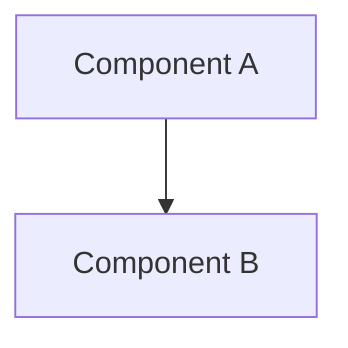
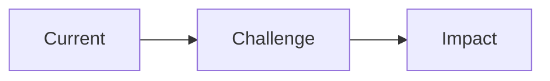
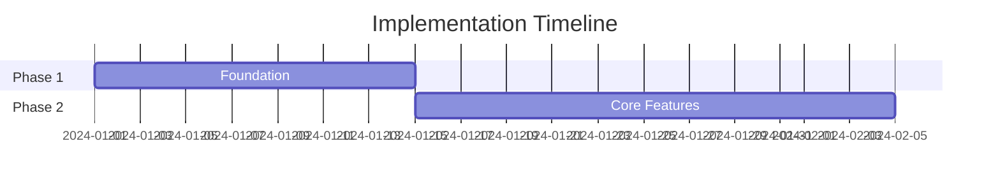

Create and improve technical documentation, presentations, and stakeholder communications.

## When to Use

### This Skill Is For

- Writing README files and project documentation
- Creating API documentation
- Drafting RFCs and design documents
- Technical specification writing
- Architecture review presentations
- Technical proposal decks
- Project status updates
- Executive summaries
- Documentation review and improvement

### Use a Different Approach When

- Creating architecture diagrams only → use `/diagram`
- Recording architecture decisions → use `/architecture --adr`
- Code-level comments → handle inline during development

## Document Types

| Type | Purpose | Audience | Format |
|------|---------|----------|--------|
| **README** | Project overview, quick start | New users, contributors | Markdown |
| **API Docs** | Endpoint reference | Developers integrating | Markdown |
| **RFC** | Propose significant changes | Team, stakeholders | Markdown |
| **Design Doc** | Technical design details | Engineers implementing | Markdown |
| **Runbook** | Operational procedures | Ops, on-call engineers | Markdown |
| **Presentation** | Visual communication | Various audiences | Slides outline |
| **Executive Summary** | Business value, ROI | C-level, stakeholders | Slides outline |

## Process

### 1. Identify Document Type

Based on the request, determine:
- What type of document is needed
- Who is the target audience
- What level of detail is appropriate
- What format (written docs vs. presentation)

### 2. Gather Information

- Review existing code and documentation
- Identify key concepts to explain
- Note examples and use cases
- List prerequisites and dependencies

### 3. Structure Content

Follow appropriate template for document type.

### 4. Write with Clarity

- Use clear, concise language
- Include code examples
- Add diagrams where helpful
- Define technical terms

### 5. Review and Refine

- Check for accuracy
- Verify code examples work
- Ensure completeness
- Test instructions

## Response Format

### README Template

```markdown
# Project Name

Brief description of what this project does and why it exists.

## Features

- Feature 1: Brief description
- Feature 2: Brief description

## Quick Start

### Prerequisites

- Node.js >= 18
- npm or yarn

### Installation

```bash
npm install project-name
```

### Basic Usage

```typescript
import { Feature } from 'project-name';

const result = Feature.doSomething();
console.log(result);
```

## Documentation

- [API Reference](./docs/api.md)
- [Configuration Guide](./docs/configuration.md)
- [Contributing](./CONTRIBUTING.md)

## Configuration

| Option | Type | Default | Description |
|--------|------|---------|-------------|
| `option1` | `string` | `"default"` | What this option does |

## Examples

### Example 1: Basic Usage

```typescript
// Code example with comments
```

## API Reference

### `functionName(param1, param2)`

Brief description of what the function does.

**Parameters:**
- `param1` (string): Description
- `param2` (number, optional): Description

**Returns:** `ReturnType` - Description

## Contributing

See [CONTRIBUTING.md](./CONTRIBUTING.md) for guidelines.

## License

MIT
```

### API Documentation Template

```markdown
# API Reference

## Base URL

```
https://api.example.com/v1
```

## Authentication

All requests require an API key in the header:

```
Authorization: Bearer <api-key>
```

## Endpoints

### Resource: Users

#### List Users

```
GET /users
```

**Query Parameters:**

| Parameter | Type | Required | Description |
|-----------|------|----------|-------------|
| `page` | integer | No | Page number (default: 1) |
| `limit` | integer | No | Items per page (default: 20) |

**Response:**

```json
{
  "data": [{ "id": "user_123", "name": "John Doe" }],
  "pagination": { "page": 1, "limit": 20, "total": 100 }
}
```

## Error Responses

| Status | Code | Description |
|--------|------|-------------|
| 400 | `INVALID_REQUEST` | Request validation failed |
| 401 | `UNAUTHORIZED` | Invalid or missing API key |
| 404 | `NOT_FOUND` | Resource not found |
```

### RFC Template

```markdown
# RFC: [Title]

**Status:** Draft | In Review | Accepted | Rejected | Implemented
**Author:** [Name]
**Created:** YYYY-MM-DD

## Summary

One paragraph explaining the proposal.

## Motivation

Why are we doing this? What problem does it solve?

## Detailed Design

### Overview

High-level description of the solution.

### Technical Approach

Detailed technical explanation with code examples.

### Migration Strategy

How to transition from current state.

## Alternatives Considered

### Alternative 1: [Name]

**Pros:** [List]
**Cons:** [List]
**Why not chosen:** [Reason]

## Risks and Mitigations

| Risk | Likelihood | Impact | Mitigation |
|------|------------|--------|------------|
| Risk 1 | Medium | High | Strategy |

## Open Questions

- [ ] Question that needs resolution

## Timeline

| Phase | Duration | Deliverable |
|-------|----------|-------------|
| Design | 1 week | Finalized RFC |
```

### Design Document Template

```markdown
# Design Document: [Feature Name]

**Author:** [Name]
**Reviewers:** [Names]
**Status:** Draft | Approved | Implemented

## Context

Background information and current state.

## Goals

- Goal 1
- Goal 2

## Non-Goals

- What this design explicitly does NOT address

## Design

### System Architecture



### Component Design

Purpose and responsibility with interface definitions.

### Data Flow

How data moves through the system.

### Error Handling

How errors are handled at each layer.

## Implementation Plan

- [ ] Phase 1: Foundation
- [ ] Phase 2: Core features

## Testing Strategy

How this will be tested.

## Security Considerations

Security implications and mitigations.
```

### Presentation Template

```markdown
## Presentation: [Title]

**Purpose**: [What this presentation achieves]
**Audience**: [Who will view this]
**Duration**: [Estimated time]
**Key Message**: [One sentence summary]

---

### Slide 1: Title

**[Presentation Title]**

[Subtitle / Context]
[Presenter Name]
[Date]

---

### Slide 2: Executive Summary

**Key Takeaways**

- Point 1: [Main insight]
- Point 2: [Main insight]
- Point 3: [Main insight]

**Recommendation**: [Action requested]

---

### Slide 3: Context / Problem

**Current State**

[Describe the problem or opportunity]



**Why This Matters**: [Business impact]

---

### Slide 4: Proposed Solution

**Architecture Overview**


**Key Components**:
- Component A: [Purpose]
- Component B: [Purpose]

---

### Slide 5: Trade-off Analysis

**Options Considered**

| Criterion | Option A | Option B | Option C |
|-----------|----------|----------|----------|
| Cost | $$ | $$$ | $ |
| Complexity | Low | High | Medium |
| Risk | Low | Medium | Low |

**Recommendation**: Option A

---

### Slide 6: Implementation Plan

**Roadmap**



---

### Slide 7: Risks and Mitigations

| Risk | Probability | Impact | Mitigation |
|------|-------------|--------|------------|
| Risk 1 | Medium | High | [Strategy] |

---

### Slide 8: Resource Requirements

- **Team**: [X engineers, Y weeks]
- **Budget**: [$X for infrastructure/tools]
- **Dependencies**: [External dependencies]

---

### Slide 9: Success Metrics

| Metric | Current | Target | Timeline |
|--------|---------|--------|----------|
| Metric 1 | X | Y | 3 months |

---

### Slide 10: Next Steps

**Immediate Actions**

1. [Action 1] — Owner: [Name] — Due: [Date]
2. [Action 2] — Owner: [Name] — Due: [Date]

**Decision Needed**: [What approval is required]

---

### Slide 11: Q&A

**Questions?**

[Contact information]
[Links to detailed documentation]

---

## Appendix

### Appendix A: Technical Details
[Deep dive content]

### Appendix B: Cost Breakdown
[Detailed analysis]
```

## Presentation Types

| Type | Structure | Focus |
|------|-----------|-------|
| **Architecture Review** | Current → Challenges → Proposed → Migration → Risks | Design decisions |
| **Technical Proposal** | Problem → Goals → Solution → Alternatives → Plan | Implementation details |
| **Project Update** | Summary → Accomplishments → Metrics → Blockers → Plans | Progress status |
| **Executive Summary** | Key Message → Context → Recommendation → Investment → ROI | Business value |

## Writing Guidelines

### Clarity Principles

1. **Lead with the point** — State the main idea first
2. **Use active voice** — "The function returns" not "A value is returned"
3. **Be specific** — "Returns in 50ms" not "Returns quickly"
4. **Show, don't tell** — Use code examples liberally
5. **Define acronyms** — Spell out on first use

### Presentation Guidelines

1. **One message per slide** — Don't overload
2. **6x6 rule** — Max 6 bullets, 6 words each
3. **Lead with conclusion** — Pyramid principle
4. **Use diagrams** — Visualize architecture and data

### Documentation Review Checklist

- [ ] Accurate and up-to-date
- [ ] Code examples tested and working
- [ ] All parameters documented
- [ ] Error cases covered
- [ ] Prerequisites listed
- [ ] Links functional

## Error Handling

| Scenario | Response |
|----------|----------|
| Unclear scope | Ask what should be documented |
| Missing context | Request access to relevant code |
| Outdated docs | Flag discrepancies found |
| Complex topic | Break into multiple documents |
| Unclear audience | Ask who will view the content |
| Too much content | Suggest splitting or using appendix |

## Related Skills

| Skill | When to Use Instead |
|-------|---------------------|
| `/diagram` | Visual documentation only |
| `/architecture` | Designing system before documenting |
| `/architecture --adr` | Recording architecture decisions |
| `/explore` | Understanding system before documenting |
