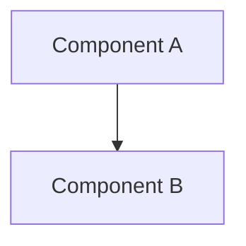
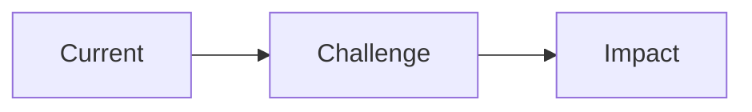
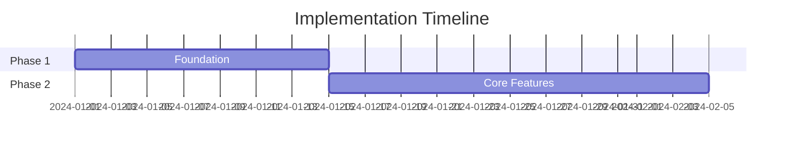

# Documentation Templates

Complete templates for different document types.

## README Template

```markdown
# Project Name

Brief description of what this project does and why it exists.

## Features

- Feature 1: Brief description
- Feature 2: Brief description

## Quick Start

### Prerequisites

- Node.js >= 18
- npm or yarn

### Installation

```bash
npm install project-name
```

### Basic Usage

```typescript
import { Feature } from 'project-name';

const result = Feature.doSomething();
console.log(result);
```

## Documentation

- [API Reference](./docs/api.md)
- [Configuration Guide](./docs/configuration.md)
- [Contributing](./CONTRIBUTING.md)

## Configuration

| Option | Type | Default | Description |
|--------|------|---------|-------------|
| `option1` | `string` | `"default"` | What this option does |

## Examples

### Example 1: Basic Usage

```typescript
// Code example with comments
```

## API Reference

### `functionName(param1, param2)`

Brief description of what the function does.

**Parameters:**
- `param1` (string): Description
- `param2` (number, optional): Description

**Returns:** `ReturnType` - Description

## Contributing

See [CONTRIBUTING.md](./CONTRIBUTING.md) for guidelines.

## License

MIT
```

## API Documentation Template

```markdown
# API Reference

## Base URL

```
https://api.example.com/v1
```

## Authentication

All requests require an API key in the header:

```
Authorization: Bearer <api-key>
```

## Endpoints

### Resource: Users

#### List Users

```
GET /users
```

**Query Parameters:**

| Parameter | Type | Required | Description |
|-----------|------|----------|-------------|
| `page` | integer | No | Page number (default: 1) |
| `limit` | integer | No | Items per page (default: 20) |

**Response:**

```json
{
  "data": [{ "id": "user_123", "name": "John Doe" }],
  "pagination": { "page": 1, "limit": 20, "total": 100 }
}
```

## Error Responses

| Status | Code | Description |
|--------|------|-------------|
| 400 | `INVALID_REQUEST` | Request validation failed |
| 401 | `UNAUTHORIZED` | Invalid or missing API key |
| 404 | `NOT_FOUND` | Resource not found |
```

## RFC Template

```markdown
# RFC: [Title]

**Status:** Draft | In Review | Accepted | Rejected | Implemented
**Author:** [Name]
**Created:** YYYY-MM-DD

## Summary

One paragraph explaining the proposal.

## Motivation

Why are we doing this? What problem does it solve?

## Detailed Design

### Overview

High-level description of the solution.

### Technical Approach

Detailed technical explanation with code examples.

### Migration Strategy

How to transition from current state.

## Alternatives Considered

### Alternative 1: [Name]

**Pros:** [List]
**Cons:** [List]
**Why not chosen:** [Reason]

## Risks and Mitigations

| Risk | Likelihood | Impact | Mitigation |
|------|------------|--------|------------|
| Risk 1 | Medium | High | Strategy |

## Open Questions

- [ ] Question that needs resolution

## Timeline

| Phase | Duration | Deliverable |
|-------|----------|-------------|
| Design | 1 week | Finalized RFC |
```

## Design Document Template

```markdown
# Design Document: [Feature Name]

**Author:** [Name]
**Reviewers:** [Names]
**Status:** Draft | Approved | Implemented

## Context

Background information and current state.

## Goals

- Goal 1
- Goal 2

## Non-Goals

- What this design explicitly does NOT address

## Design

### System Architecture



### Component Design

Purpose and responsibility with interface definitions.

### Data Flow

How data moves through the system.

### Error Handling

How errors are handled at each layer.

## Implementation Plan

- [ ] Phase 1: Foundation
- [ ] Phase 2: Core features

## Testing Strategy

How this will be tested.

## Security Considerations

Security implications and mitigations.
```

## Presentation Template

```markdown
## Presentation: [Title]

**Purpose**: [What this presentation achieves]
**Audience**: [Who will view this]
**Duration**: [Estimated time]
**Key Message**: [One sentence summary]

---

### Slide 1: Title

**[Presentation Title]**

[Subtitle / Context]
[Presenter Name]
[Date]

---

### Slide 2: Executive Summary

**Key Takeaways**

- Point 1: [Main insight]
- Point 2: [Main insight]
- Point 3: [Main insight]

**Recommendation**: [Action requested]

---

### Slide 3: Context / Problem

**Current State**

[Describe the problem or opportunity]



**Why This Matters**: [Business impact]

---

### Slide 4: Proposed Solution

**Architecture Overview**


**Key Components**:
- Component A: [Purpose]
- Component B: [Purpose]

---

### Slide 5: Trade-off Analysis

**Options Considered**

| Criterion | Option A | Option B | Option C |
|-----------|----------|----------|----------|
| Cost | $$ | $$$ | $ |
| Complexity | Low | High | Medium |
| Risk | Low | Medium | Low |

**Recommendation**: Option A

---

### Slide 6: Implementation Plan

**Roadmap**



---

### Slide 7: Risks and Mitigations

| Risk | Probability | Impact | Mitigation |
|------|-------------|--------|------------|
| Risk 1 | Medium | High | [Strategy] |

---

### Slide 8: Next Steps

**Immediate Actions**

1. [Action 1] — Owner: [Name] — Due: [Date]
2. [Action 2] — Owner: [Name] — Due: [Date]

**Decision Needed**: [What approval is required]

---

### Slide 9: Q&A

**Questions?**

[Contact information]
[Links to detailed documentation]
```
