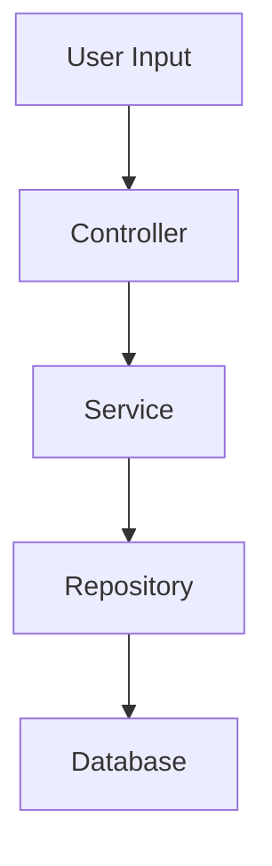

Guide structured feature development from specification through incremental implementation with clear milestones and verification steps.

## When to Use

### This Skill Is For

- Planning and implementing new features
- Breaking down features into incremental deliverables
- Creating feature specifications and acceptance criteria
- Guiding test-driven development for features
- Managing feature scope and dependencies

### Use a Different Approach When

- Fixing a bug → address directly or use `/review` to understand the issue
- Refactoring without new functionality → use `/clean-code`
- High-level architecture decisions → use `/architecture`
- Understanding existing features → use `/explore`

## Input Classification

| Type | Indicators | Approach |
|------|-----------|----------|
| **Greenfield** | "new feature", "add capability" | Full specification + implementation |
| **Enhancement** | "improve", "extend", "add to existing" | Impact analysis + incremental change |
| **Integration** | "connect", "integrate with" | Interface design + compatibility check |
| **Migration** | "replace", "upgrade" | Parallel implementation + switchover |

## Process

### 1. Feature Specification

Gather requirements before implementation:

```markdown
## Feature Specification

**Name**: [Feature name]
**Owner**: [Who owns this feature]
**Priority**: [P0-Critical | P1-High | P2-Medium | P3-Low]

### Problem Statement
[What problem does this feature solve?]

### User Stories
As a [user type], I want [capability] so that [benefit].

### Acceptance Criteria
- [ ] [Criterion 1]
- [ ] [Criterion 2]
- [ ] [Criterion 3]

### Out of Scope
- [What this feature will NOT do]

### Dependencies
- [External dependencies]
- [Internal dependencies]
```

### 2. Technical Analysis

Analyze the codebase for:
- Existing patterns to follow
- Code to modify vs. create
- Integration points
- Test coverage requirements

### 3. Implementation Plan

Break down into incremental milestones:

| Milestone | Deliverable | Dependencies | Verification |
|-----------|------------|--------------|--------------|
| M1 | Core domain types | None | Unit tests pass |
| M2 | Service implementation | M1 | Integration tests pass |
| M3 | API/UI integration | M2 | E2E tests pass |
| M4 | Documentation | M3 | Review complete |

### 4. Incremental Implementation

For each milestone:

1. **Write tests first** (TDD approach)
2. **Implement minimum viable code**
3. **Verify against acceptance criteria**
4. **Refactor if needed**
5. **Commit with clear message**

### 5. Feature Verification

Before marking complete:
- [ ] All acceptance criteria met
- [ ] Tests passing (unit, integration, e2e)
- [ ] Code reviewed
- [ ] Documentation updated
- [ ] Feature flag configured (if applicable)

## Response Format

```markdown
## Feature Development Plan

**Feature**: [Name]
**Complexity**: [Low | Medium | High]
**Estimated Scope**: [S | M | L | XL]

---

### Specification

#### Problem Statement
[What problem this solves]

#### User Stories
1. As a [user], I want [capability] so that [benefit]

#### Acceptance Criteria
- [ ] [Criterion with measurable outcome]

#### Non-Functional Requirements
- Performance: [Requirement]
- Security: [Requirement]
- Scalability: [Requirement]

---

### Technical Design

#### Existing Patterns
[Analysis of similar features in codebase]

#### Component Design



#### Files to Create

| File | Purpose | Tests |
|------|---------|-------|
| `src/domain/[entity].ts` | Domain model | `tests/unit/[entity].test.ts` |
| `src/services/[feature].ts` | Business logic | `tests/integration/[feature].test.ts` |

#### Files to Modify

| File | Change | Reason |
|------|--------|--------|
| `src/routes/index.ts` | Add route | Expose feature endpoint |

#### Interfaces

```typescript
interface FeatureInput {
  // Input fields
}

interface FeatureOutput {
  // Output fields
}
```

---

### Implementation Plan

#### Milestone 1: Domain Layer
**Goal**: Establish core types and business rules

**Tasks**:
- [ ] Create domain entity
- [ ] Define value objects
- [ ] Write unit tests

**Verification**: `npm test -- domain/[feature]`

**Commit**: `feat: add [feature] domain model`

---

#### Milestone 2: Service Layer
**Goal**: Implement business logic

**Tasks**:
- [ ] Create service interface
- [ ] Implement service
- [ ] Write integration tests

**Verification**: `npm test -- services/[feature]`

**Commit**: `feat: implement [feature] service`

---

#### Milestone 3: Presentation Layer
**Goal**: Expose feature to users

**Tasks**:
- [ ] Add API endpoint / UI component
- [ ] Write E2E tests
- [ ] Update API documentation

**Verification**: `npm run test:e2e`

**Commit**: `feat: expose [feature] API endpoint`

---

#### Milestone 4: Documentation & Cleanup
**Goal**: Production readiness

**Tasks**:
- [ ] Update README
- [ ] Add feature documentation
- [ ] Clean up any TODOs
- [ ] Final review

**Commit**: `docs: add [feature] documentation`

---

### Risk Assessment

| Risk | Likelihood | Impact | Mitigation |
|------|------------|--------|------------|
| [Risk 1] | Low/Med/High | Low/Med/High | [Strategy] |

### Open Questions

- [ ] [Question that needs resolution]

### Next Steps

1. [Immediate next action]
2. [Following action]
```

## Incremental Delivery Patterns

### Vertical Slice

Deliver end-to-end functionality for a narrow use case:

```
Slice 1: Create basic entity (full stack)
Slice 2: Add validation (full stack)
Slice 3: Add advanced features (full stack)
```

### Horizontal Layer

Build foundation first, then add capabilities:

```
Layer 1: Domain model complete
Layer 2: All services complete
Layer 3: All endpoints complete
```

### Feature Flags

For gradual rollout:

```typescript
if (featureFlags.isEnabled('new-feature')) {
  // New implementation
} else {
  // Existing behavior
}
```

## Error Handling

| Scenario | Response |
|----------|----------|
| Unclear requirements | Ask clarifying questions before planning |
| Large scope | Recommend breaking into multiple features |
| Missing dependencies | Identify blockers, suggest sequencing |
| Conflicting requirements | Surface trade-offs, request decision |

## Related Skills

| Skill | When to Use Instead |
|-------|---------------------|
| `/architecture` | Need high-level design before feature planning |
| `/patterns` | Feature requires specific design pattern |
| `/review` | Feature implementation needs code review |
| `/adr` | Feature involves significant technical decision |
| `/explore` | Need to understand existing features first |
