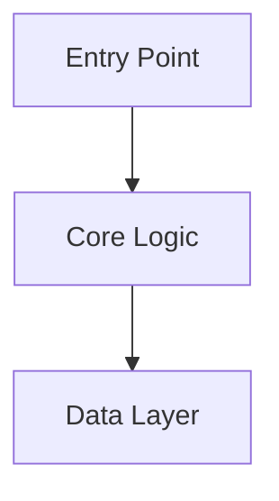

# Feature Development Templates

## Feature Development Plan Template

```markdown
## Feature Development Plan

**Feature**: [Name]
**Complexity**: [Low | Medium | High]
**Estimated Scope**: [S | M | L | XL]

---

### Specification

#### Problem Statement
[What problem this solves]

#### User Stories
1. As a [user], I want [capability] so that [benefit]

#### Acceptance Criteria
- [ ] [Criterion with measurable outcome]

#### Non-Functional Requirements
- Performance: [Requirement]
- Security: [Requirement]
- Scalability: [Requirement]

---

### Technical Design

#### Existing Patterns
[Analysis of similar features in codebase]

#### Component Design



#### Files to Create

| File | Purpose | Tests |
|------|---------|-------|
| `path/to/file` | [Purpose] | `path/to/test` |

#### Files to Modify

| File | Change | Reason |
|------|--------|--------|
| `path/to/file` | [Change] | [Why needed] |

---

### Implementation Plan

#### Milestone 1: Foundation
**Goal**: [What this milestone establishes]

**Tasks**:
- [ ] [Specific task]
- [ ] [Specific task]

**Verification**: [How to verify completion]

**Commit**: `feat: [commit message]`

---

#### Milestone 2: Core Implementation
**Goal**: [What this milestone delivers]

**Tasks**:
- [ ] [Specific task]
- [ ] [Specific task]

**Verification**: [How to verify completion]

**Commit**: `feat: [commit message]`

---

#### Milestone 3: Integration
**Goal**: [What this milestone connects]

**Tasks**:
- [ ] [Specific task]
- [ ] [Specific task]

**Verification**: [How to verify completion]

**Commit**: `feat: [commit message]`

---

#### Milestone 4: Polish & Documentation
**Goal**: Production readiness

**Tasks**:
- [ ] Update documentation
- [ ] Final review
- [ ] Clean up TODOs

**Commit**: `docs: add [feature] documentation`

---

### Risk Assessment

| Risk | Likelihood | Impact | Mitigation |
|------|------------|--------|------------|
| [Risk 1] | Low/Med/High | Low/Med/High | [Strategy] |

### Open Questions

- [ ] [Question that needs resolution]

### Next Steps

1. [Immediate next action]
2. [Following action]
```

## Incremental Delivery Patterns

### Vertical Slice

Deliver end-to-end functionality for a narrow use case:

```
Slice 1: Create basic entity (full stack)
Slice 2: Add validation (full stack)
Slice 3: Add advanced features (full stack)
```

**Best for**: Getting feedback early, validating integration points, demonstrating progress quickly.

### Horizontal Layer

Build foundation first, then add capabilities:

```
Layer 1: Domain model complete
Layer 2: All services complete
Layer 3: All endpoints complete
```

**Best for**: When dependencies are clear, team can parallelize, architecture is well-defined.

### Feature Flags

For gradual rollout:

```typescript
if (featureFlags.isEnabled('new-feature')) {
  // New implementation
} else {
  // Existing behavior
}
```

**Best for**: Risk mitigation, A/B testing, gradual rollout to users, easy rollback.
