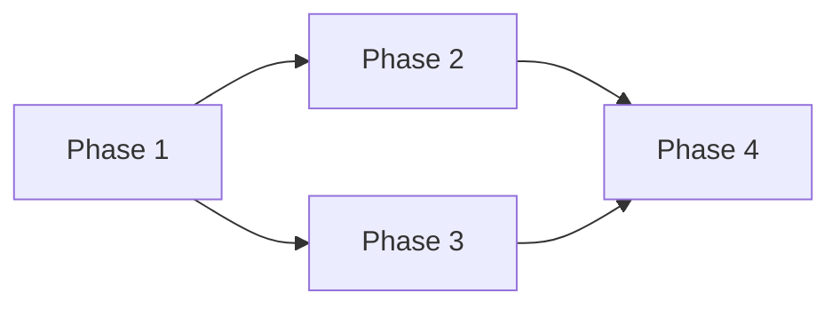

# Plan Templates

## Project Plan Template

```markdown
## Project Plan

**Goal**: [One-sentence goal]
**Source**: [Jira ticket ID, epic, or goal description]
**Created**: [Date]

---

### Definition of Done

Observable truths that must be TRUE when this goal is complete:

#### Artifacts
- [ ] [Specific file/code that must exist]

#### Behavior
- [ ] [Specific runtime behavior that must be verifiable]

#### Integration
- [ ] [Specific wiring/connection that must be in place]

#### Quality
- [ ] [Specific test/pattern requirement]

---

### Phase Breakdown

#### Phase 1: [Name]
**Goal**: [What this phase achieves]
**Dependencies**: None
**Observable Truths Satisfied**: [List from Definition of Done]

**Files to Create**:
| File | Purpose |
|------|---------|
| `path/to/file` | [Purpose] |

**Files to Modify**:
| File | Change | Reason |
|------|--------|--------|
| `path/to/file` | [Change] | [Why] |

**Verification**:
- [ ] [Specific command or condition to verify]

---

#### Phase 2: [Name]
**Goal**: [What this phase achieves]
**Dependencies**: Phase 1
**Observable Truths Satisfied**: [List from Definition of Done]

**Files to Create**:
| File | Purpose |
|------|---------|
| `path/to/file` | [Purpose] |

**Files to Modify**:
| File | Change | Reason |
|------|--------|--------|
| `path/to/file` | [Change] | [Why] |

**Verification**:
- [ ] [Specific command or condition to verify]

---

### Dependency Graph

[Use a mermaid diagram for complex plans]



### Risk Assessment

| Risk | Likelihood | Impact | Mitigation |
|------|------------|--------|------------|
| [Risk] | Low/Med/High | Low/Med/High | [Strategy] |

### Open Questions

- [ ] [Question that needs resolution before or during implementation]
```

## Architecture Comparison Template

Use this during Step 5 (Architecture Design) when presenting approaches to the user.

```markdown
### Architecture Options

| Dimension | Minimal Changes | Clean Architecture | Pragmatic Balance |
|-----------|----------------|-------------------|-------------------|
| Files changed | [count] | [count] | [count] |
| New abstractions | [list or "none"] | [list] | [list] |
| Risk | [assessment] | [assessment] | [assessment] |
| Best when | [conditions] | [conditions] | [conditions] |

**Recommendation**: [Approach] — [one sentence rationale]
```

## Session State Template (.planning/STATE.md)

```markdown
## Planning State

**Goal**: [One-sentence goal]
**Plan Created**: [Date]
**Last Updated**: [Date]

---

### Progress

| Phase | Status | Notes |
|-------|--------|-------|
| Phase 1: [Name] | [Pending / In Progress / Complete / Blocked] | [Brief note] |
| Phase 2: [Name] | [Pending / In Progress / Complete / Blocked] | [Brief note] |

### Current Phase

**Phase**: [Current phase name]
**Status**: [In Progress / Blocked]
**Next Steps**:
1. [Immediate next action]
2. [Following action]

### Blockers

| Blocker | Impact | Resolution |
|---------|--------|------------|
| [Description] | [Which phase] | [How to resolve] |

### Key Decisions

| Decision | Rationale | Date |
|----------|-----------|------|
| Architecture: [Minimal Changes / Clean Architecture / Pragmatic Balance] | [Why this approach was chosen] | [When] |
| [Other decision] | [Why] | [When] |

### Completed Phases

#### Phase 1: [Name]
- **Completed**: [Date]
- **Observable Truths Verified**: [List]
- **Notes**: [Any deviations from plan]
```

