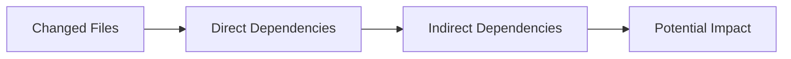
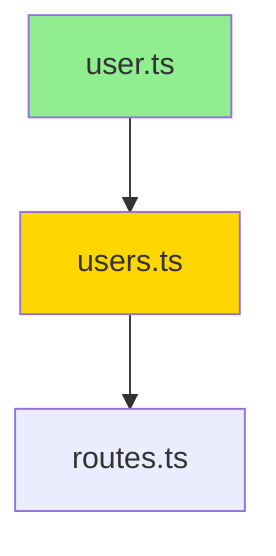

Perform comprehensive pull request analysis with multi-file change assessment, impact analysis, and merge readiness evaluation.

## When to Use

### This Skill Is For

- Reviewing pull requests before merge
- Analyzing multi-file changes and their interactions
- Assessing merge readiness and risk
- Generating review comments for PRs
- Understanding change impact across the codebase

### Use a Different Approach When

- Reviewing a single file in isolation → use `/review`
- Deep code quality analysis without PR context → use `/clean-code`
- Security-focused review → use `/security`

## Process

### 1. PR Context Gathering

```bash
# Get PR information
gh pr view <number> --json title,body,author,baseRefName,headRefName,files,additions,deletions,changedFiles

# Get the diff
gh pr diff <number>

# Get PR comments and reviews
gh pr view <number> --json reviews,comments
```

### 2. Change Classification

Categorize files by change type:

| Category | Indicators | Review Focus |
|----------|-----------|--------------|
| **Core Logic** | Business rules, algorithms | Correctness, edge cases |
| **API Changes** | Endpoints, contracts | Breaking changes, versioning |
| **Data Layer** | Models, migrations, queries | Data integrity, performance |
| **Configuration** | Config files, env vars | Security, deployment impact |
| **Tests** | Test files | Coverage, quality |
| **Documentation** | README, comments | Accuracy, completeness |
| **Dependencies** | package.json, lock files | Security, compatibility |

### 3. Impact Analysis

Assess the blast radius:



- **Direct Impact**: Files modified in this PR
- **Downstream Impact**: Files that depend on changed code
- **Upstream Impact**: Changes to dependencies used by modified code

### 4. Risk Assessment

| Risk Factor | Low | Medium | High |
|-------------|-----|--------|------|
| Files Changed | 1-5 | 6-15 | 16+ |
| Lines Changed | <100 | 100-500 | 500+ |
| Test Coverage | Added/Updated | Unchanged | Removed |
| Breaking Changes | None | Internal only | External API |
| Reviewers Needed | 1 | 2 | 3+ |

### 5. Review Dimensions

For each changed file, evaluate:

1. **Correctness** — Does the change work as intended?
2. **Consistency** — Does it follow existing patterns?
3. **Completeness** — Are all necessary changes included?
4. **Testing** — Is the change adequately tested?
5. **Documentation** — Are changes documented?

### 6. Merge Readiness Checklist

- [ ] All tests passing
- [ ] No merge conflicts
- [ ] Code review approved
- [ ] Documentation updated
- [ ] Breaking changes documented
- [ ] Migration plan (if needed)
- [ ] Rollback plan identified

## Response Format

```markdown
## Pull Request Review

**PR**: #[number] — [title]
**Author**: @[username]
**Base**: [base-branch] ← [head-branch]
**Files Changed**: [count] | **+[additions]** / **-[deletions]**

---

### Summary

[2-3 sentence summary of what this PR does and why]

### Change Analysis

#### File Breakdown

| File | Type | Risk | Key Changes |
|------|------|------|-------------|
| `src/api/users.ts` | Core Logic | Medium | New endpoint for user preferences |
| `src/models/user.ts` | Data Layer | Low | Added preferences field |
| `tests/api/users.test.ts` | Tests | Low | Coverage for new endpoint |

#### Dependency Graph



**Changed**: Green | **Affected**: Yellow | **Unchanged**: Default

### Impact Assessment

**Blast Radius**: [Low | Medium | High]

- **Direct**: [X files modified]
- **Downstream**: [Y files depend on changes]
- **External**: [Impact on APIs, clients, integrations]

### Review Findings

#### Must Address (Blocking)

1. **[Issue]** — `file:line`
   - **Problem**: [Description]
   - **Suggestion**:
   ```diff
   - current
   + suggested
   ```

#### Should Address (Non-blocking)

1. **[Issue]** — `file:line` — [Brief suggestion]

#### Consider (Optional)

- [Improvement idea]

### Testing Analysis

| Test Type | Status | Notes |
|-----------|--------|-------|
| Unit Tests | ✅ Added | Covers happy path |
| Integration | ⚠️ Missing | API integration not tested |
| E2E | N/A | No E2E impact |

**Coverage Delta**: [+X% | -X% | No change]

### Risk Assessment

| Factor | Assessment | Notes |
|--------|------------|-------|
| Complexity | [Low/Med/High] | [Explanation] |
| Breaking Changes | [Yes/No] | [Details] |
| Rollback Difficulty | [Easy/Med/Hard] | [Strategy] |
| Deploy Considerations | [None/Some/Many] | [Requirements] |

### Merge Readiness

| Criterion | Status |
|-----------|--------|
| Tests Passing | ✅ / ❌ |
| No Conflicts | ✅ / ❌ |
| Review Approved | ✅ / ❌ |
| Docs Updated | ✅ / ❌ / N/A |
| Breaking Changes Documented | ✅ / ❌ / N/A |

**Verdict**: ✅ **Ready to Merge** | ⚠️ **Needs Changes** | ❌ **Not Ready**

### Recommended Actions

**Before Merge**:
1. [Action item]

**After Merge**:
1. [Post-merge task]

### Review Comments

[Ready-to-post review comments for GitHub]

---

**Reviewer Notes**: [Any additional context or concerns]
```

## GitHub Review Comment Generation

When generating comments for GitHub:

```markdown
### Comment Template

**Location**: `file:line`
**Type**: [suggestion | issue | question | praise]

---

[Comment body with context]

```suggestion
// Suggested code change (GitHub suggestion format)
```
```

## Error Handling

| Scenario | Response |
|----------|----------|
| PR not found | Check PR number/URL, verify access |
| Cannot fetch diff | Fall back to file-by-file review |
| Too many files | Prioritize by risk, note coverage gaps |
| No test changes | Flag as concern, recommend additions |

## Related Skills

| Skill | When to Use Instead |
|-------|---------------------|
| `/review` | Single file or local changes review |
| `/security` | Security-focused PR review |
| `/architecture` | PR introduces architectural changes |
| `/clean-code` | Deep code quality analysis of PR contents |
