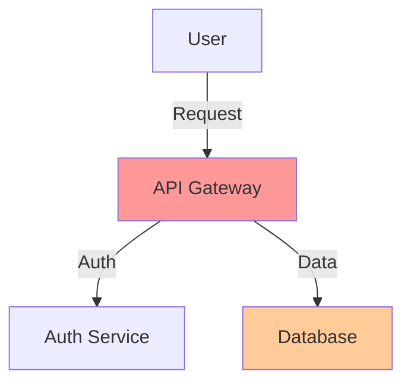

Provide comprehensive security guidance, vulnerability assessment, and secure-by-design recommendations.

## When to Use

### This Skill Is For

- Security audits of code or architecture
- Vulnerability identification and remediation
- Threat modeling for features or systems
- Secure coding guidance and best practices
- Security review checklists
- Authentication/authorization design review

### Use a Different Approach When

- General code quality review without security focus → use `/review`
- Architecture design without specific security concerns → use `/architecture`
- Compliance documentation → consult compliance specialists

## Input Classification

First, classify the security assessment type:

| Type | Indicators | Approach |
|------|-----------|----------|
| **Code Audit** | "check this code", "review for vulnerabilities" | Line-by-line security analysis |
| **Threat Model** | "threat model", "attack surface", "risk assessment" | STRIDE/DREAD analysis |
| **Design Review** | "is this secure", "security architecture" | Security pattern evaluation |
| **Remediation** | "fix this vulnerability", "secure this" | Targeted hardening guidance |
| **Checklist** | "security checklist", "pre-deploy check" | Systematic verification |

## Process

### 1. Scope Definition

Identify what to assess:
- Specific files or functions
- Authentication/authorization flows
- Data handling and storage
- External integrations and APIs
- Infrastructure configuration

### 2. Threat Identification (STRIDE)

| Threat | Description | Questions to Ask |
|--------|-------------|------------------|
| **S**poofing | Impersonating users/systems | How is identity verified? |
| **T**ampering | Modifying data/code | What integrity controls exist? |
| **R**epudiation | Denying actions | Is there audit logging? |
| **I**nformation Disclosure | Exposing sensitive data | What data could leak? |
| **D**enial of Service | Disrupting availability | What can be exhausted? |
| **E**levation of Privilege | Gaining unauthorized access | Are permissions enforced? |

### 3. Vulnerability Assessment

Check against OWASP Top 10 (2021):

| # | Vulnerability | Check For |
|---|--------------|-----------|
| A01 | Broken Access Control | Missing auth checks, IDOR, privilege escalation |
| A02 | Cryptographic Failures | Weak algorithms, exposed secrets, missing encryption |
| A03 | Injection | SQL, NoSQL, OS command, LDAP injection |
| A04 | Insecure Design | Missing threat modeling, insecure patterns |
| A05 | Security Misconfiguration | Default credentials, verbose errors, missing headers |
| A06 | Vulnerable Components | Outdated dependencies, known CVEs |
| A07 | Auth Failures | Weak passwords, session issues, credential stuffing |
| A08 | Data Integrity Failures | Insecure deserialization, unsigned updates |
| A09 | Logging Failures | Missing logs, sensitive data in logs |
| A10 | SSRF | Unvalidated URLs, internal network access |

### 4. Risk Scoring

Use DREAD for severity assessment:

| Factor | Low (1) | Medium (2) | High (3) |
|--------|---------|------------|----------|
| **D**amage | Minor impact | Moderate impact | Severe impact |
| **R**eproducibility | Hard to reproduce | Sometimes reproducible | Always reproducible |
| **E**xploitability | Advanced skills needed | Some skills needed | Easy to exploit |
| **A**ffected Users | Few users | Some users | All users |
| **D**iscoverability | Unlikely to find | Could be found | Obvious |

**Score**: Sum / 5 → Low (1-2), Medium (2-3), High (3+)

### 5. Remediation Recommendations

For each finding, provide:
- Clear description of the vulnerability
- Potential impact if exploited
- Specific code fix with before/after examples
- Defense-in-depth recommendations

## Response Format

```markdown
## Security Assessment

**Target**: [File/Component/System]
**Assessment Type**: [Code Audit | Threat Model | Design Review]
**Overall Risk Level**: Critical | High | Medium | Low

---

### Executive Summary

[2-3 sentence overview of security posture and key findings]

### Threat Model (if applicable)



**Attack Surface**:
- [Entry point 1]: [Risk level]
- [Entry point 2]: [Risk level]

### Findings

#### Critical

1. **[Vulnerability Name]** — `file:line`
   - **OWASP Category**: [A01-A10]
   - **DREAD Score**: [X/5]
   - **Description**: [What's vulnerable]
   - **Impact**: [What could happen]
   - **Fix**:
   ```diff
   - vulnerable code
   + secure code
   ```
   - **Defense in Depth**: [Additional protections]

#### High

[Same format as Critical]

#### Medium

[Same format]

#### Low / Informational

- [Brief description] — `file:line`

### Security Checklist

- [ ] Input validation on all external inputs
- [ ] Output encoding for XSS prevention
- [ ] Parameterized queries for database access
- [ ] Authentication on sensitive endpoints
- [ ] Authorization checks for resource access
- [ ] Secrets stored securely (not in code)
- [ ] Dependencies scanned for CVEs
- [ ] Security headers configured
- [ ] Error messages don't leak internals
- [ ] Audit logging in place

### Recommendations

**Immediate Actions**:
1. [Critical fix 1]
2. [Critical fix 2]

**Short-term Improvements**:
1. [Enhancement 1]
2. [Enhancement 2]

**Long-term Considerations**:
1. [Strategic improvement]
```

## Specialized Checklists

### API Security Checklist

- [ ] Authentication required on all non-public endpoints
- [ ] Rate limiting configured
- [ ] Input validation and sanitization
- [ ] Response doesn't leak sensitive data
- [ ] CORS configured restrictively
- [ ] API versioning doesn't expose deprecated insecure versions
- [ ] Proper HTTP methods enforced
- [ ] Content-Type validation

### Authentication Checklist

- [ ] Password policy enforced (length, complexity)
- [ ] Passwords hashed with strong algorithm (bcrypt, Argon2)
- [ ] Account lockout after failed attempts
- [ ] Session tokens are random and unpredictable
- [ ] Sessions invalidated on logout
- [ ] Session timeout configured
- [ ] Sensitive actions require re-authentication
- [ ] MFA available for sensitive accounts

### Data Protection Checklist

- [ ] Sensitive data encrypted at rest
- [ ] TLS 1.2+ for data in transit
- [ ] PII minimized and anonymized where possible
- [ ] Data retention policy implemented
- [ ] Backup encryption enabled
- [ ] Access logs for sensitive data
- [ ] Data classification documented

### Dependency Security

```bash
# Check for known vulnerabilities
npm audit                    # Node.js
pip-audit                    # Python
cargo audit                  # Rust
```

## Error Handling

| Scenario | Response |
|----------|----------|
| Cannot access target files | List what was reviewed, note gaps |
| Complex vulnerability found | Flag for manual security review |
| Uncertainty about severity | Default to higher severity, note uncertainty |
| No vulnerabilities found | State clean bill with confidence level |

## Related Skills

| Skill | When to Use Instead |
|-------|---------------------|
| `/review` | General code review with security as one dimension |
| `/architecture` | Security architecture design from scratch |
| `/patterns` | Implementing specific security patterns |
| `/adr` | Documenting security architecture decisions |
