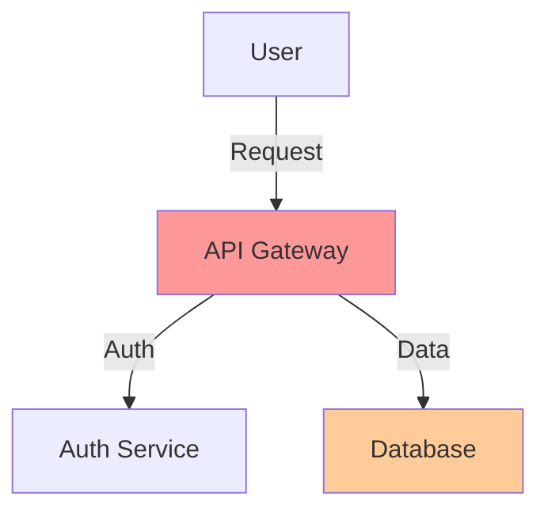

# Security Assessment Template

```markdown
## Security Assessment

**Target**: [File/Component/System]
**Assessment Type**: [Code Audit | Threat Model | Design Review]
**Overall Risk Level**: Critical | High | Medium | Low

---

### Executive Summary

[2-3 sentence overview of security posture and key findings]

### Threat Model (if applicable)



**Attack Surface**:
- [Entry point 1]: [Risk level]
- [Entry point 2]: [Risk level]

### Findings

#### Critical

1. **[Vulnerability Name]** — `file:line`
   - **OWASP Category**: [A01-A10]
   - **DREAD Score**: [X/5]
   - **Description**: [What's vulnerable]
   - **Impact**: [What could happen]
   - **Fix**:
   ```diff
   - vulnerable code
   + secure code
   ```
   - **Defense in Depth**: [Additional protections]

#### High

[Same format as Critical]

#### Medium

[Same format]

#### Low / Informational

- [Brief description] — `file:line`

### Security Checklist

- [ ] Input validation on all external inputs
- [ ] Output encoding for XSS prevention
- [ ] Parameterized queries for database access
- [ ] Authentication on sensitive endpoints
- [ ] Authorization checks for resource access
- [ ] Secrets stored securely (not in code)
- [ ] Dependencies scanned for CVEs
- [ ] Security headers configured
- [ ] Error messages don't leak internals
- [ ] Audit logging in place

### Recommendations

**Immediate Actions**:
1. [Critical fix 1]
2. [Critical fix 2]

**Short-term Improvements**:
1. [Enhancement 1]
2. [Enhancement 2]

**Long-term Considerations**:
1. [Strategic improvement]
```
