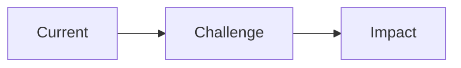
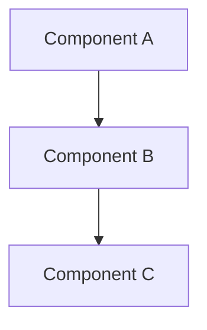
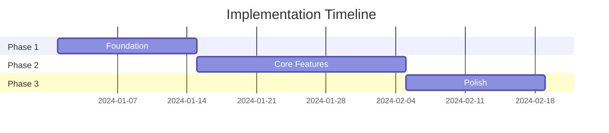
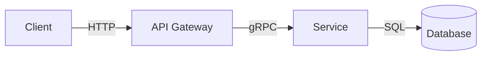

Create structured presentation outlines and content for architecture reviews, technical proposals, and stakeholder communication.

## When to Use

### This Skill Is For

- Architecture review presentations
- Technical proposal decks
- Project status updates
- Executive summaries
- Team knowledge sharing
- Client-facing technical presentations

### Use a Different Approach When

- Creating detailed technical documentation → use `/docs`
- Creating diagrams only → use `/diagram`
- Recording decisions → use `/adr`

## Presentation Types

| Type | Audience | Focus | Depth |
|------|----------|-------|-------|
| **Executive Summary** | C-level, stakeholders | Business value, ROI | High-level |
| **Architecture Review** | Technical leads, architects | Design decisions, trade-offs | Deep |
| **Technical Proposal** | Engineering teams | Implementation details | Very deep |
| **Project Update** | Mixed audience | Progress, blockers, next steps | Medium |
| **Knowledge Share** | Engineers | Learning, best practices | Deep |

## Process

### 1. Define Presentation Goals

- Who is the audience?
- What decision or action is needed?
- What's the key message?
- How much time is available?

### 2. Structure Content

Follow the pyramid principle:
1. Lead with the conclusion
2. Support with key arguments
3. Provide evidence and details

### 3. Create Visual Aids

- Use diagrams for architecture
- Use charts for data
- Use tables for comparisons
- Minimize text per slide

### 4. Review and Refine

- One message per slide
- 6x6 rule: max 6 bullets, 6 words each
- Practice timing

## Response Format

### Presentation Outline

```markdown
## Presentation: [Title]

**Purpose**: [What this presentation achieves]
**Audience**: [Who will view this]
**Duration**: [Estimated time]
**Key Message**: [One sentence summary]

---

### Slide 1: Title

**[Presentation Title]**

[Subtitle / Context]

[Presenter Name]
[Date]

---

### Slide 2: Executive Summary

**Key Takeaways**

- Point 1: [Main insight]
- Point 2: [Main insight]
- Point 3: [Main insight]

**Recommendation**: [Action requested]

---

### Slide 3: Context / Problem

**Current State**

[Describe the problem or opportunity]



**Why This Matters**: [Business impact]

---

### Slide 4: Proposed Solution

**Architecture Overview**



**Key Components**:
- Component A: [Purpose]
- Component B: [Purpose]
- Component C: [Purpose]

---

### Slide 5: Trade-off Analysis

**Options Considered**

| Criterion | Option A | Option B | Option C |
|-----------|----------|----------|----------|
| Cost | $$ | $$$ | $ |
| Complexity | Low | High | Medium |
| Timeline | 4 weeks | 8 weeks | 6 weeks |
| Risk | Low | Medium | Low |

**Recommendation**: Option A

---

### Slide 6: Implementation Plan

**Roadmap**



**Milestones**:
- Week 2: Foundation complete
- Week 5: Core features ready
- Week 7: Production ready

---

### Slide 7: Risks and Mitigations

**Risk Assessment**

| Risk | Probability | Impact | Mitigation |
|------|-------------|--------|------------|
| Risk 1 | Medium | High | [Strategy] |
| Risk 2 | Low | Medium | [Strategy] |

---

### Slide 8: Resource Requirements

**What We Need**

- **Team**: [X engineers, Y weeks]
- **Budget**: [$X for infrastructure/tools]
- **Dependencies**: [External dependencies]

---

### Slide 9: Success Metrics

**How We Measure Success**

| Metric | Current | Target | Timeline |
|--------|---------|--------|----------|
| Metric 1 | X | Y | 3 months |
| Metric 2 | A | B | 6 months |

---

### Slide 10: Next Steps

**Immediate Actions**

1. [Action 1] — Owner: [Name] — Due: [Date]
2. [Action 2] — Owner: [Name] — Due: [Date]
3. [Action 3] — Owner: [Name] — Due: [Date]

**Decision Needed**: [What approval is required]

---

### Slide 11: Q&A

**Questions?**

[Contact information]
[Links to detailed documentation]

---

## Appendix

### Appendix A: Technical Details

[Deep dive content for technical audience]

### Appendix B: Cost Breakdown

[Detailed cost analysis]

### Appendix C: References

- [Link to ADR]
- [Link to design doc]
- [Link to RFC]
```

## Presentation Templates

### Architecture Review

```markdown
1. Title & Context
2. Current Architecture
3. Challenges / Pain Points
4. Proposed Changes
5. Architecture Diagram
6. Trade-off Analysis
7. Migration Plan
8. Risks & Mitigations
9. Timeline & Resources
10. Decision Request
```

### Technical Proposal

```markdown
1. Problem Statement
2. Goals & Non-Goals
3. Proposed Solution
4. Technical Design
5. Alternatives Considered
6. Implementation Plan
7. Testing Strategy
8. Rollback Plan
9. Success Metrics
10. Next Steps
```

### Project Update

```markdown
1. Summary (Green/Yellow/Red status)
2. Accomplishments This Period
3. Metrics & Progress
4. Blockers & Risks
5. Plans for Next Period
6. Help Needed
```

### Executive Summary

```markdown
1. Title & Key Message
2. Business Context
3. Recommendation (lead with conclusion)
4. Supporting Evidence
5. Investment Required
6. Expected Returns
7. Timeline
8. Ask / Decision Needed
```

## Visual Design Guidelines

### Diagram Best Practices



### Color Coding

| Color | Meaning |
|-------|---------|
| Green | Current / Approved |
| Blue | Proposed / New |
| Yellow | Attention needed |
| Red | Risk / Problem |
| Gray | Deprecated / Old |

### Chart Selection

| Data Type | Chart Type |
|-----------|------------|
| Trend over time | Line chart |
| Comparison | Bar chart |
| Composition | Pie chart (sparingly) |
| Relationship | Scatter plot |
| Flow | Sankey diagram |

## Speaker Notes Format

```markdown
### Slide N: [Title]

**Key Point**: [Main message]

**Talking Points**:
- Point to emphasize
- Supporting detail
- Transition to next slide

**Timing**: ~2 minutes

**Potential Questions**:
- Q: [Anticipated question]
- A: [Prepared answer]
```

## Error Handling

| Scenario | Response |
|----------|----------|
| Unclear audience | Ask who will view the presentation |
| Too much content | Suggest splitting or using appendix |
| Missing data | Note placeholders, request specifics |
| Time constraints | Prioritize slides, move detail to appendix |

## Related Skills

| Skill | When to Use Instead |
|-------|---------------------|
| `/diagram` | Just need diagrams, not full presentation |
| `/docs` | Detailed documentation instead of slides |
| `/adr` | Recording decision for future reference |
| `/architecture` | Designing architecture before presenting |
